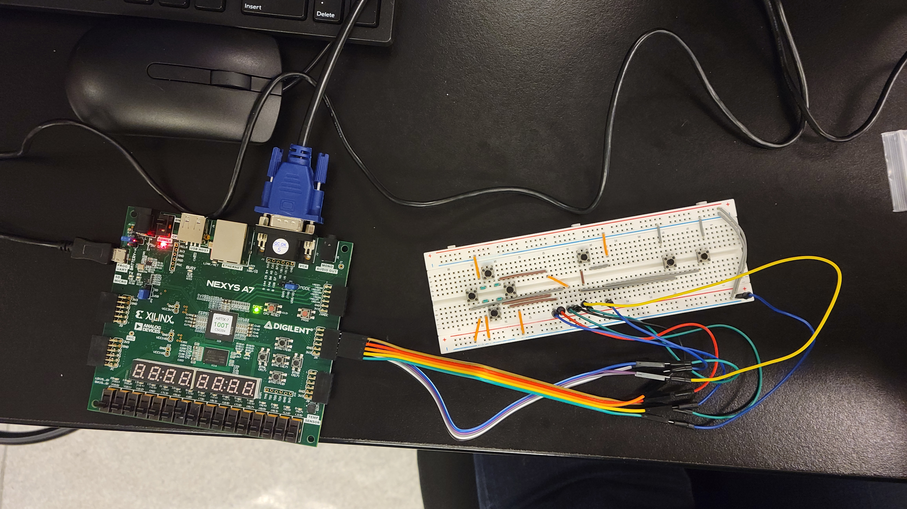
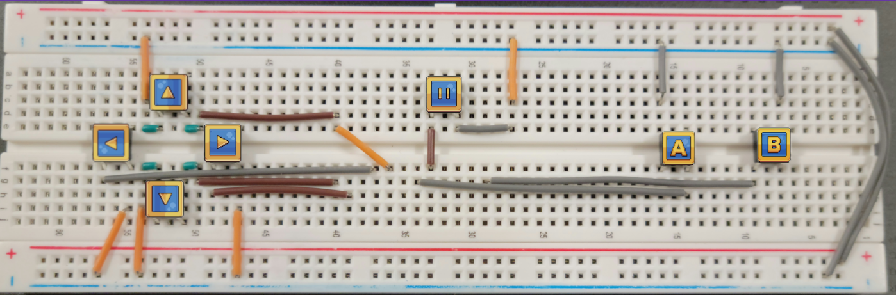
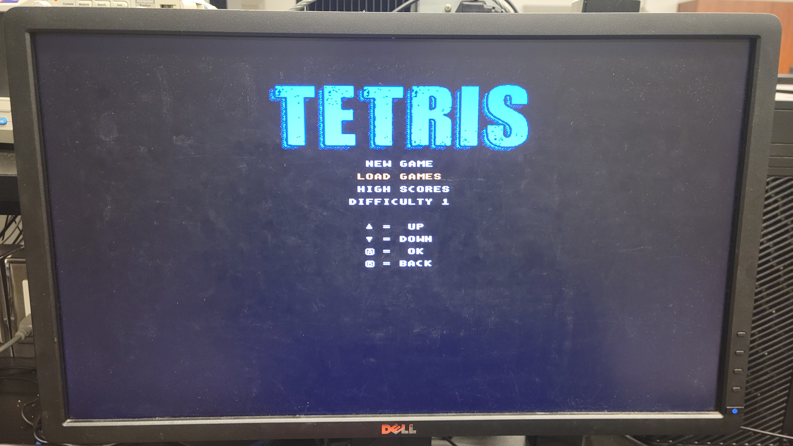
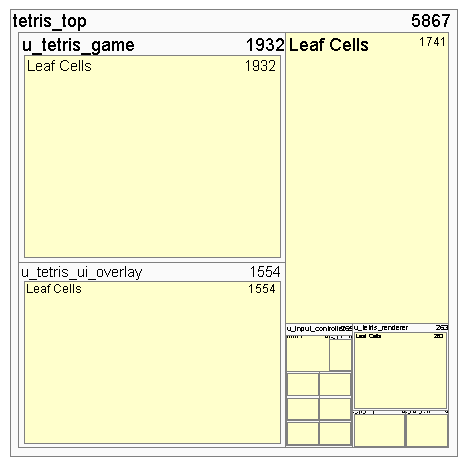
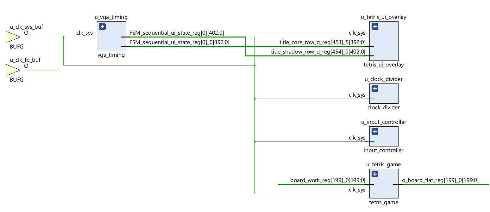

<h1> Tetris (RTL) </h1>

FPGA Tetris for the Digilent Nexys A7-100T with a custom UI/render pipeline in Verilog.

---

<h2> Table of Contents </h2>

- [Setup](#setup)
- [Controller](#controller)
- [Demo](#demo)
- [Key Features](#key-features)
- [System Overview](#system-overview)
  - [Hierachy Diagram](#hierachy-diagram)
  - [Dataflow Design](#dataflow-design)
- [Module Overview](#module-overview)
- [UI Flow](#ui-flow)
- [Implementation Results](#implementation-results)
- [Future Improvements](#future-improvements)

---

## Setup

1. Create an RTL project in Vivado from the repo root (`C:\Vivado\Tetris`).
2. Add HDL sources from `sources_1\imports\rtl`.
3. Add the constraints file from `constrs_1\new` (or provide your own for a different board).
4. Generate the bitstream and program the FPGA.
5. Wire the PMOD JA pins to your controller as shown below.
6. Connect a VGA monitor and start the game.

## Controller

Seven buttons are shared between UI navigation and gameplay. Left/right move the tetromino, hard drop slams it to the floor, and soft drop speeds fall while held. The pause button is purely used to save game state and exit to the main menu.

| Action                | Nexys BTN     | PMOD JA        | Notes                                                            |
| --------------------- | ------------- | -------------- | ---------------------------------------------------------------- |
| Left/Right (◀️/▶️)    | BTN_L / BTN_R | JA1 / JA2      | Also scrolls menu entries when gameplay is paused.               |
| Soft Drop  (🔼)       | BTN_C         | JA3            | Only input with auto-repeat; doubles as "up" in menus.           |
| Hard Drop  (🔽)       | BTN_D         | JA4            | Drops instantly; doubles as "down" in menus.                     |
| Pause      (⏸️)       | -             | JA7 (or BTN_C) | Opens pause menu with Resume / Save Slot 1-3 / Main Menu.        |
| Rotate     (🅰️)       | BTN_U         | JA8            | Confirms menu selections, loads saves, restarts after game over. |
| Hold       (🅱️)       | -             | JA9            | Swaps active/hold pieces and cancels menu dialogs.               |

## Demo

Here is a live demo of navigating the UI and gameplay with the controller.

## Key Features

- **Controlled Clocking** - MMCM halves the 100 MHz oscillator to 50 MHz, then `clock_divider.v` derives the 25 MHz pixel enable and a gravity tick that scales with difficulty.
- **Gameplay Core** - `tetris_game.v` manages board state, scoring, hold/next logic, save-state serialization, and high-score promotion with `tetris_shapes.vh` driving masks/colors.
- **Renderer + Overlay** - `tetris_renderer.v` draws the playfield, hold and next panels, score/hi-score text; `tetris_ui_overlay.v` adds animated title ROMs, menus, help, difficulty, pause, and game-over overlays.
- **Persistence and UX** - Three pause-menu save slots captured directly from board state, plus a rolling top-three global high-score list rendered inside the UI.
- **Input flexibility** - Supports onboard buttons and PMOD JA arcade buttons, respecting generics (`USE_INT_RST`, `USE_INT_SOFTBTN`) for different control schemes.

---

## System Overview

1. **Clock Domain** - `tetris_top.v` instantiates an MMCM + BUFG to produce a clean 50 MHz system clock. `clock_divider.v` generates a 25 MHz pixel pulse plus a programmable gravity tick derived from the level setting.
2. **Input Path** - `input_controller.v` debounces every button, emits 1-cycle pulses, implements soft-drop auto-repeat, and gates menu navigation so presses are intentional.
3. **Gameplay Path** - `tetris_game.v` consumes the pulses, updates the board (row-major bitfield), manages hold/swap, generates binary + BCD scores, and asserts `o_board_update` for rendering.
4. **Rendering Path** - `vga_timing.v` streams 640x480 coordinates. `tetris_renderer.v` paints the play scene and `tetris_ui_overlay.v` can override RGB when menus or titles are active.
5. **UI State Machine** - A top-level FSM moves through MENU -> LOAD -> LEVEL -> PLAY -> PAUSE -> HIGH SCORE -> GAME OVER, handling saves/loads and gating gameplay pulses.

### Hierachy Diagram

### Dataflow Design

---

## Module Overview

| Module              | Path                                        | Description                                                                                                                                                  |
| ------------------- | ------------------------------------------- | ------------------------------------------------------------------------------------------------------------------------------------------------------------ |
| `tetris_top`        | `sources_1/imports/rtl/tetris_top.v`        | Integrates clocking, input gating, UI FSM, gameplay core, renderer, and overlay into the VGA + button interfaces; manages save slots and global high scores. |
| `clock_divider`     | `sources_1/imports/rtl/clock_divider.v`     | Divides the 50 MHz system clock into a 25 MHz pixel enable and a programmable gameplay tick tied to the selected difficulty.                                 |
| `input_controller`  | `sources_1/imports/rtl/input_controller.v`  | Instantiates per-button debouncers, generates edge pulses, soft-drop auto-repeat, and suppresses menu auto-repeat via navigation gating.                     |
| `debouncer`         | `sources_1/imports/rtl/debouncer.v`         | Synchronizes and filters a single asynchronous input; reused for every button.                                                                               |
| `tetris_game`       | `sources_1/imports/rtl/tetris_game.v`       | Maintains the 10x20 board bitmap, seven-bag randomizer, hold/swap state, scoring (binary + BCD), save/load serialization, and high-score outputs.            |
| `tetris_shapes`     | `sources_1/imports/rtl/tetris_shapes.vh`    | Provides tetromino masks and color lookup tables shared by gameplay and renderer/overlay logic.                                                              |
| `tetris_renderer`   | `sources_1/imports/rtl/tetris_renderer.v`   | Converts the flattened board, active piece, hold/next previews, and score digits into RGB pixels synced to VGA coordinates; highlights fresh line clears.    |
| `tetris_ui_overlay` | `sources_1/imports/rtl/tetris_ui_overlay.v` | Draws title cards, menus, help text, score lists, pause overlays, and animated prompts by reading ROM glyphs (`tetris_font.vh`, `titles/*.vh`).              |
| `tetris_font`       | `sources_1/imports/rtl/tetris_font.vh`      | 8x8 ASCII font ROM plus helper functions for digits/arrows used across renderer and overlay text paths.                                                      |
| `vga_timing`        | `sources_1/imports/rtl/vga_timing.v`        | Generates 640x480@60 Hz timing (hsync/vsync/active window) and current pixel coordinates used by both renderer and overlay modules.                          |

---

## UI Flow

1. **Main Menu** - New Game, Load Games, High Scores, Difficulty (current level displayed).
2. **Level Select** - Up/Down buttons move the level cursor, A commits, swap cancels.
3. **Load Screen** - Shows slot status (READY/EMPTY). Rotate loads if populated; swap returns to menu.
4. **Play** - Renderer shows the active board, hold/next panels, score, and high score.
5. **Pause** - Resume, Save Slot 1-3, and Main Menu options. Selecting a save copies board/score/level into slot arrays.
6. **High Score** - Renders the top three `global_high_score` entries stored in hardware.
7. **Game Over** - Displays final BCD score with button hints (rotate = restart, swap = main menu).

---

## Implementation Results

| Metric      | Value                                                                            | Report                                 |
| ----------- | -------------------------------------------------------------------------------- | -------------------------------------- |
| Timing      | WNS = 0.289 ns, TNS = 0 ns, WHS = 0.039 ns, THS = 0 ns, WPWS = 3 ns, TPWS = 0 ns | `tetris_top_timing_summary_routed.rpt` |
| Utilization | 10,590 LUT (16.7%), 3,365 FF (2.7%), 0 BRAM, 0 DSP, 26 IOB, 1 MMCM, 2 BUFG       | `tetris_top_utilization_placed.rpt`    |
| Power       | 0.263 W total (0.165 W dynamic + 0.098 W static)                                 | `tetris_top_power_routed.rpt`          |

---

## Future Improvements

1. **Audio pipeline** - Simple PSG or PWM-driven beeps for line clears and game events.
2. **HDMI output** - Swap VGA for TMDS encoding to reach modern displays.
3. **Multiplayer/AI** - Add a ghost player or competitive versus core to the gameplay pipeline.

---